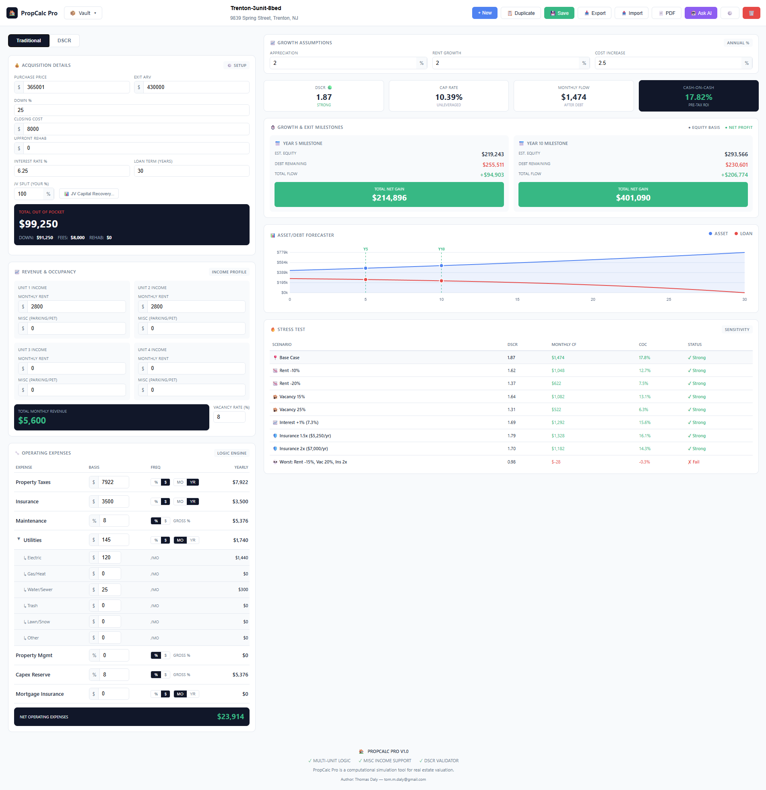

# PropCalc Pro

A comprehensive real estate investment calculator for analyzing rental property deals. Single-file web application that runs entirely in your browser with no server required.

### DSCR Mode

### Traditional Mode

## Features

### Dual Financing Modes
- **Traditional** - Standard down payment and mortgage analysis
- **DSCR** - Debt Service Coverage Ratio lending with carry costs, ideal for investors

### Key Metrics
- **DSCR Ratio** - Color-coded lender acceptance indicators (Strong/Acceptable/Marginal/Weak)
- **Cap Rate** - Unlevered return on property value
- **Monthly Cash Flow** - After debt service
- **Cash-on-Cash Return** - Pre-tax ROI on invested capital

### Advanced Analysis Tools

#### JV Capital Recovery
Analyze joint venture partnership deals:
- Model protection periods where 100% of cash flow goes to capital recovery
- Configure post-payback profit splits
- Track remaining capital and stabilized returns
- Compare different refi timing scenarios

#### Mixed Carry Rates
Support for multiple carry cost tranches with different rates (e.g., hard money + private money)

#### Stress Testing
See how your deal performs under adverse conditions:
- Rent reductions (-5%, -10%)
- Vacancy increases (+5%, +10%)
- Interest rate changes (+1%, +2%)
- Insurance premium spikes (1.5x, 2x)

#### Asset/Debt Forecaster
30-year projection chart showing:
- Property appreciation over time
- Loan paydown trajectory
- Equity growth visualization
- Year 5 and Year 10 milestone markers

### Data Management
- **Vault** - Save and manage multiple property analyses
- **Auto-save** - Working state persists automatically
- **Export/Import** - JSON backup and restore
- **PDF Export** - Print-ready reports

### AI Assistant
Built-in AI chat (requires OpenAI API key) to discuss your deal, ask questions, and get insights based on your property data.

## Getting Started

1. Download `index.html`
2. Open in any modern browser
3. Start analyzing deals

No installation, no server, no dependencies. Everything runs locally in your browser.

## Usage

### Basic Workflow
1. Enter property details (purchase price, ARV, units, rents)
2. Configure expenses (taxes, insurance, utilities, etc.)
3. Set financing terms (DSCR LTV, interest rate, carry period)
4. Review metrics and projections
5. Save to vault for future reference

### DSCR Mode Tips
- Use "Mixed Carry Rates..." for complex financing with multiple lenders
- The DSCR indicator shows lender acceptance levels:
  - 🟢 **1.25+** Strong - Best rates & leverage
  - 🟡 **1.15-1.24** Acceptable - Standard approval
  - 🟠 **1.05-1.14** Marginal - May need compensating factors
  - 🔴 **1.00-1.04** Weak - Difficult approval
  - ⚫ **<1.00** No-Go - Cash flow negative

### JV Analysis
1. Click "JV Capital Recovery..." button
2. Set refi month and protection term
3. Configure your profit split percentage
4. View phase breakdown and payback projections

## Data Privacy

- All data stored locally in browser localStorage
- OpenAI API key (if used) stored locally, sent only to OpenAI
- No analytics, no tracking, no external servers

## License

MIT License - Free to use, modify, and distribute.

## Contributing

Issues and pull requests welcome at [github.com/tom-daly/prop-calc-pro](https://github.com/tom-daly/prop-calc-pro)
